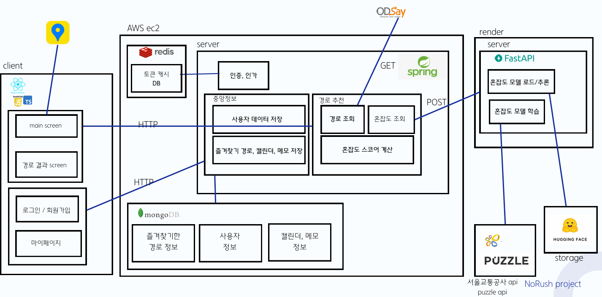
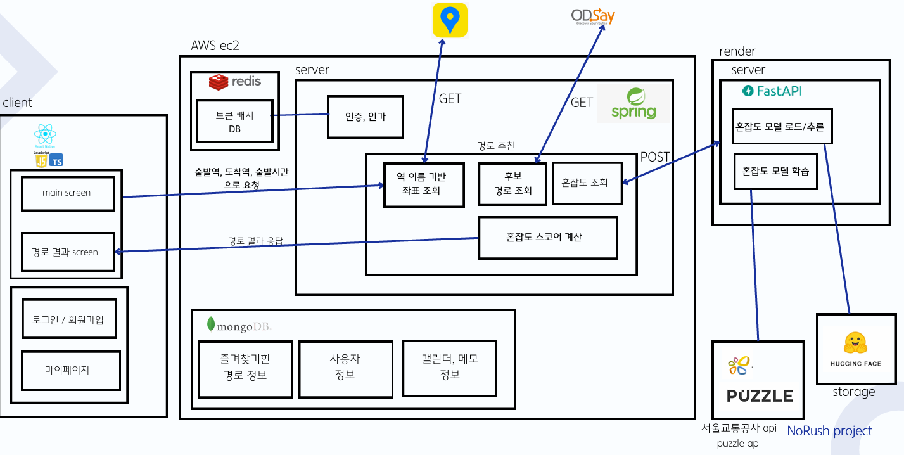
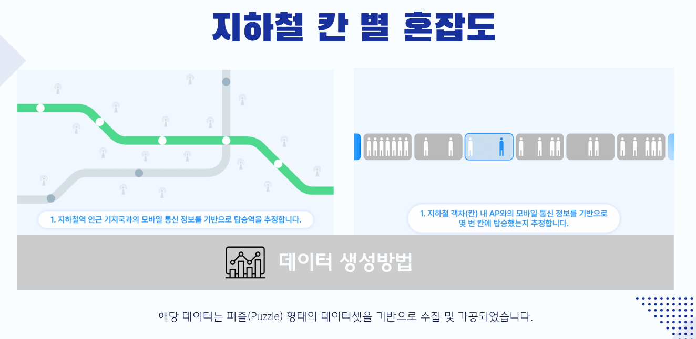
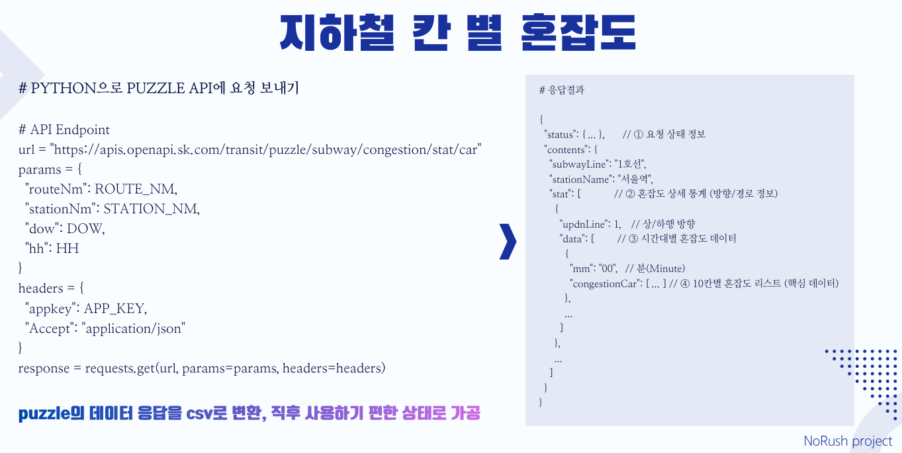
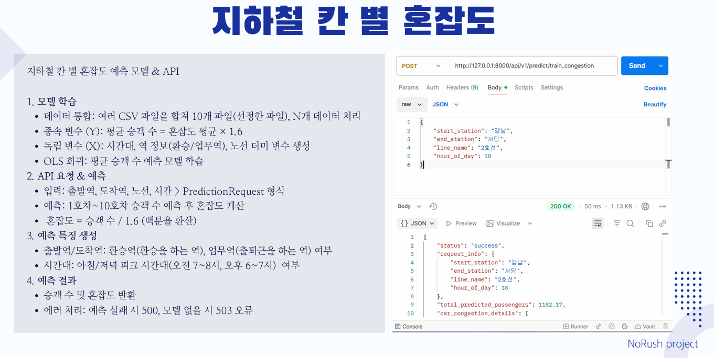
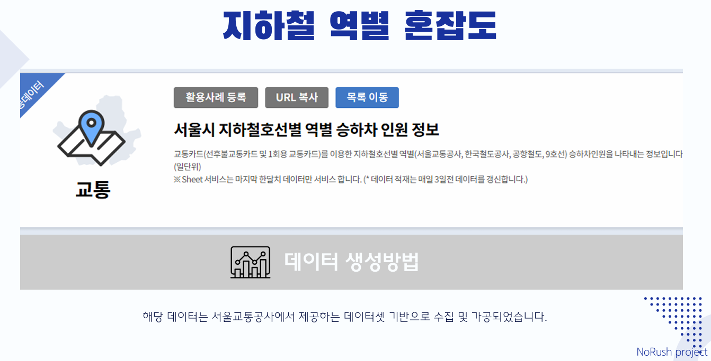
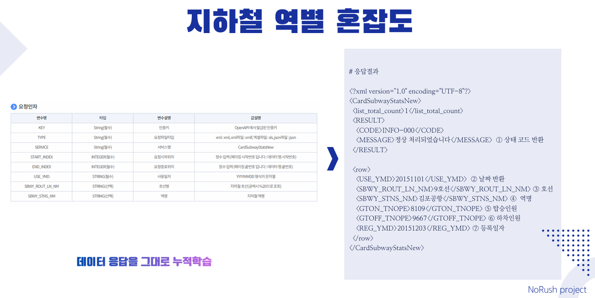
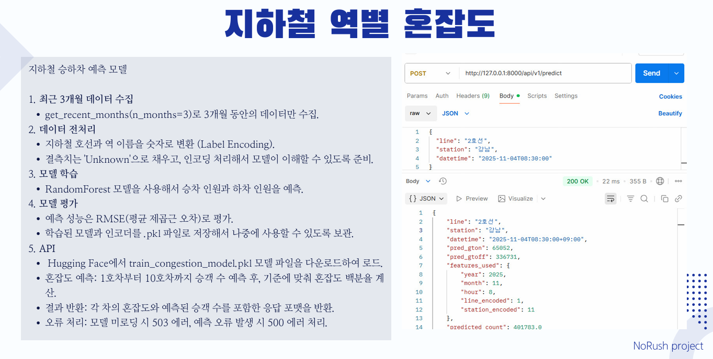
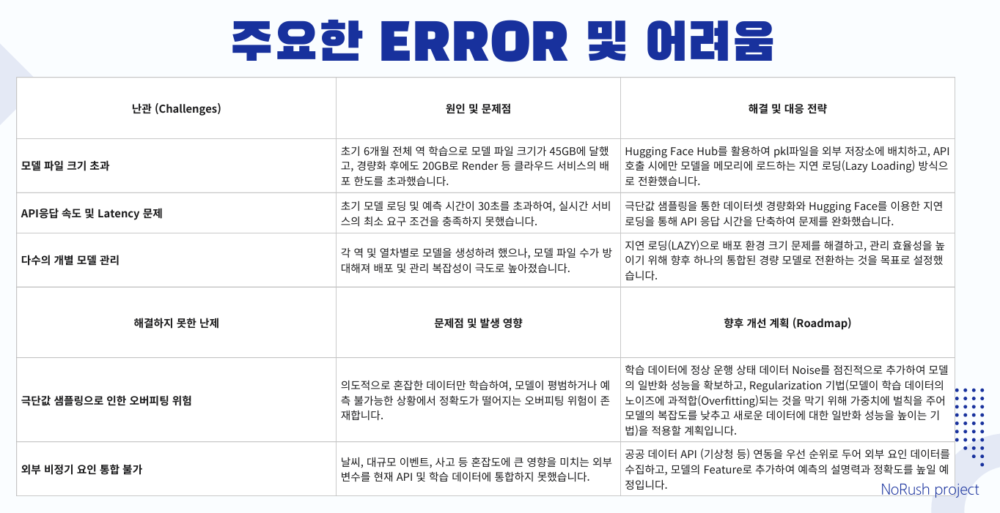
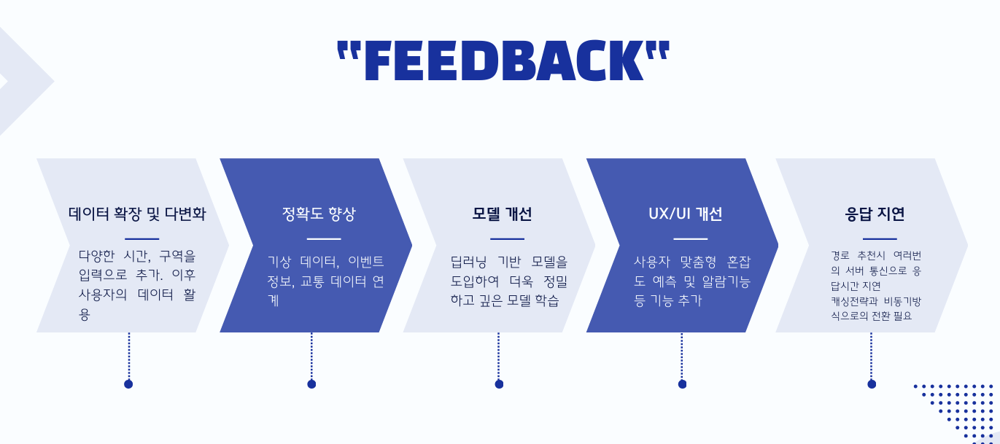

# 🚇 NoRush

> 지하철 혼잡도를 예측하는 대중교통 경로 추천 서비스

---

## 💡 프로젝트 소개

**NoRush**는 "가장 빠른 경로"가 아닌  
**덜 붐비는 쾌적한 경로**를 찾고 싶은 사용자를 위한  
**지하철 혼잡도 기반 경로 추천 서비스**입니다.

공공 데이터와 혼잡도 데이터를 활용하여  
**시간 · 역 · 호선 · 칸별 혼잡도를 예측**하고  
이를 기반으로 경로의 혼잡도를 계산합니다.

사용자는

- 출발역
- 도착역
- 출발 시간

을 입력하면

- **최소 혼잡 경로**
- **균형 추천 경로 (시간 + 혼잡도)**
- **최단 시간 경로**

를 비교하여 추천받을 수 있습니다.

---

# 🦾 주요 기능

## 🧭 혼잡도 기반 경로 추천

대중교통 API와 AI 예측 서버를 활용하여

- 시간대별 혼잡도
- 역별 혼잡도
- 칸별 혼잡도

를 계산하고 **혼잡도 + 소요 시간 기반 추천 경로**를 제공합니다.

---

## 📊 혼잡도 예측 모델

공공 데이터를 활용하여 다음 특징을 기반으로 학습합니다.

- 연도 / 월 / 요일 / 시간대
- 호선 / 역
- 상행 / 하행
- 칸 번호

FastAPI 기반 **AI 서버**에서 예측 모델을 제공하며  
Backend에서 실시간으로 호출합니다.

---

## 🗺️ 경로 및 혼잡도 시각화

[프론트엔드](https://github.com/jeongmin24/norush2025-fe)에서는 모바일 환경에서 사용자가 직관적으로 확인할 수 있도록

- 지도 기반 경로 표시
- 혼잡도 색상 표시
- 예상 소요 시간
- 경로별 혼잡도 점수

를 제공합니다.

---

### ⭐ 사용자 맞춤 기능 (확장 가능)
- 자주 이용하는 경로를 저장하는 **즐겨찾기 기능**
- 시간대별 혼잡도 패턴을 기반으로 한 **출근·퇴근 추천 시간대 안내**
- 장애인·노약자 등 교통 약자를 위한 **혼잡도 최소화 모드**  
  등으로 확장 가능하며, 추후 다양한 대중교통 수단(버스, 환승 연동 등)과의 통합도 고려하고 있습니다.

---

# 🔄 시스템 아키텍처

### Backend - AI 서버 구조

- **Main Backend (Spring Boot)**  
  사용자 인증, 즐겨찾기 관리, 서비스 로직

- **[AI Predict Server (Python/FastAPI)](https://github.com/jeongmin24/norush2025-ai)**  
  혼잡도 예측 모델 API 제공

AI 서버는 **Render**를 통해 독립 배포됩니다.

---

### 경로 조회 데이터 흐름

---

## 🚀 CI/CD

NoRush 프로젝트는 **GitHub Actions와 EC2 SSH 배포**를 이용해  
코드 변경 시 자동 빌드 및 배포가 이루어지도록 구성했습니다.

### 배포 과정

1. `main` 브랜치에 코드 Push
2. **GitHub Actions** 워크플로우 실행
3. GitHub Actions에서 **EC2 서버로 SSH 접속**
4. 서버에서 프로젝트 빌드 진행
5. `deploy.sh` 실행
6. 애플리케이션 자동 재배포

### 사용 기술

- **GitHub Actions** : CI/CD 파이프라인 관리
- **EC2** : 애플리케이션 서버
- **SSH** : 원격 배포 실행
- **deploy.sh** : 서버 빌드 및 서비스 재시작 스크립트

---

# 🚇 혼잡도 모델

## 1️⃣ 칸별 혼잡도 모델

### 데이터 수집

퍼즐(Puzzle) 데이터 기반 혼잡도 수집

---

### 데이터 전처리

Puzzle 응답을 CSV 형태로 변환 후 가공

---

### 모델 학습

칸별 혼잡도 예측 모델 학습 및 API 제공

---

## 2️⃣ 역별 혼잡도 모델

### 데이터 수집

서울교통공사 데이터 기반 수집

---

### 데이터 학습

승하차 데이터를 기반으로 학습

---

### 예측 모델

지하철 승하차 인원 예측 모델

---

## ⚠️ 주요 에러 및 향후 개선방안

데이터 처리 및 모델 학습 과정에서 발생한 주요 오류 사례

향후 개선방안 

---

## 🧰 개발 IDE & 기술 스택

NoRush 프로젝트는 **Frontend / Backend / AI / Deploy / 공통 환경**으로 구성되어 있으며, 모든 팀원이 동일한 개발 환경을 유지할 수 있도록 아래와 같이 정리했습니다.

### 🖥 Frontend

| 역할 | 구성 |
|------|------|
| **Language** |   |
| **IDE** |  |
| **Framework** |  |

### 🖥 Backend

| 역할 | 구성 |
|------|------|
| **Language** |  |
| **Framework** |  |
| **IDE** |  |
| **Build Tool** |  |
| **DB** |  |
| **API** |  |

### 🖥 AI Server

| 역할 | 구성 |
|------|------|
| **Language** |  |
| **IDE** |  |
| **Framework** |  |
| **AI Library** |  |
| **Serving** |  |
| **Environment** | CUDA / cuDNN / Ubuntu |

### 🛠 Deployment 환경

| 역할 | 구성 |
|------|------|
| **Backend Deploy** |     |
| **Frontend Deploy** | (필요 시) S3 + CloudFront 또는 기타 배포 플랫폼 |
| **AI Deploy** |  |
| **CI/CD** |  |

### 🧩 공통 협업 환경

| 역할 | 구성 |
|------|------|
| **Communication** |   |
| **Design** |  |
| **Version Control** |   |
